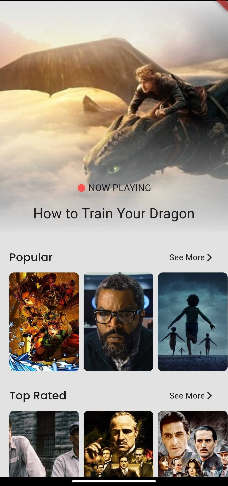
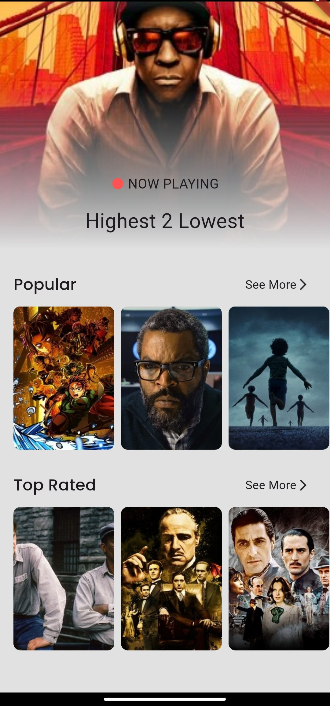
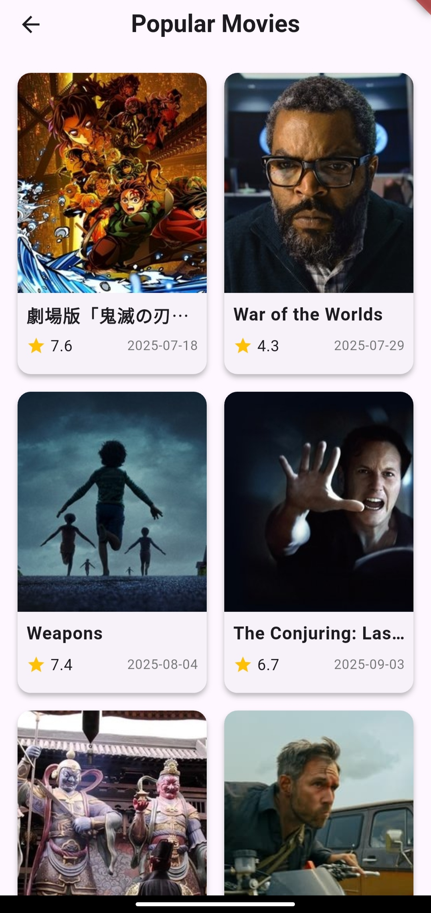
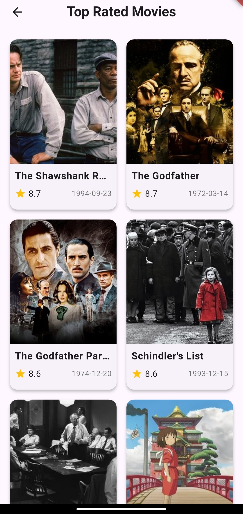
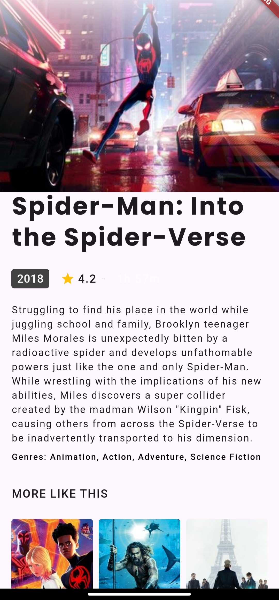
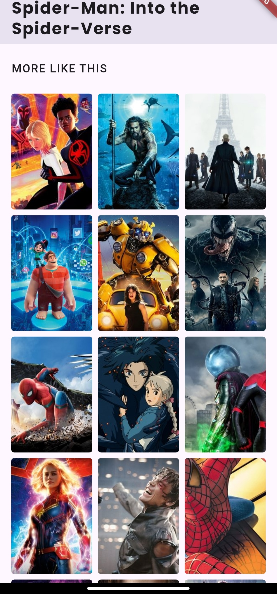

# 🎬 Flutter Movies App

A movies application built with **Flutter** using **Clean Architecture** and clean code principles.  
The app allows users to browse the latest movies, popular movies, and top-rated movies, with detailed information and recommendations for similar movies.

---

## 🚀 Features

- **Home Screen**:
  - 🎥 **Now Playing**
  - 🌟 **Popular**
  - 🏆 **Top Rated**
- **See More Screen** to display more movies for *Popular* or *Top Rated* categories.
- **Movie Details Screen** with:
  - Full movie details (title, rating, overview, etc.)
  - **Recommendations**: similar movies related to the selected one.
- **Shimmer** effect while loading.
- **Carousel Slider** on the home screen.
- Smooth **animations** using animate_do.

---

## 🏗️ Architecture

The app follows **Clean Architecture**:

- **Data Layer**: handles API integration and JSON to model conversion.
- **Domain Layer**: contains entities and use cases.
- **Presentation Layer**: UI + state management using **BLoC**.

---

## 🛠️ Tech Stack

- **State Management**: BLoC
- **Dependency Injection**: get_it
- **Navigation**: go_router
- **Functional Programming**: dartz
- **Environment Variables**: flutter_dotenv (for API Key & Base URL)
- **UI Libraries**: shimmer, animate_do, carousel_slider

---

## 📸 Screenshots

  
  
  

 

  
  
  

---

## 🎥 Watch the video on youtube

[)](https://youtu.be/6Ig0fjouw0U?si=WrFhfLxQhMVI-acw )
